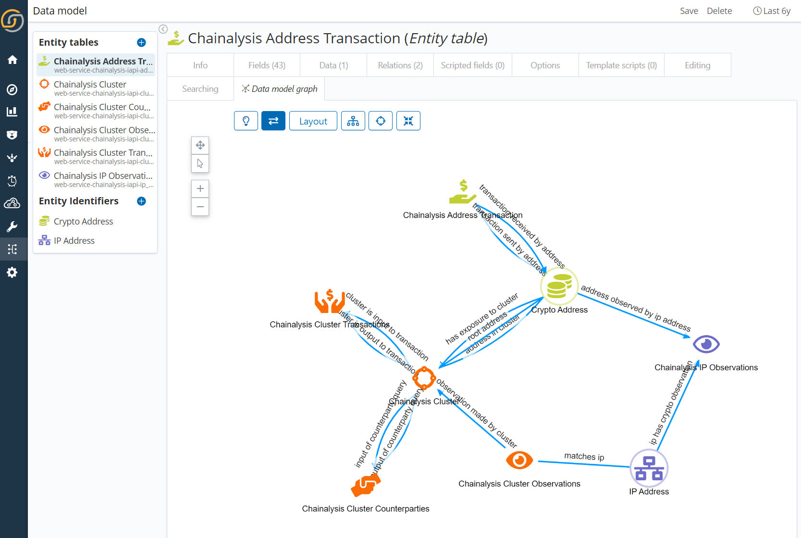
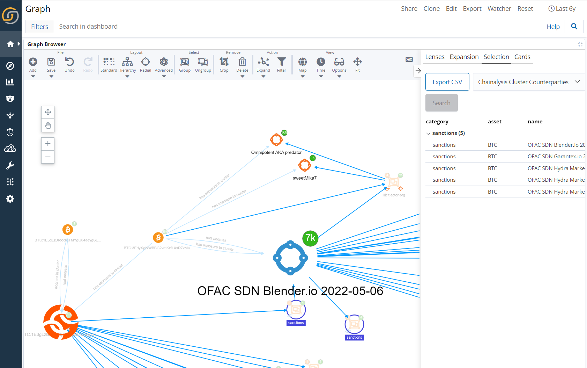

# Chainalysis Investigations API Integration With Siren Investigate


#### Data Model

### Teaser



This web service driver consists of services for the chainalysis-iapi service group.

# Development
See [here](https://www.npmjs.com/package/@sirensolutions/web-service-interface) for information on how to develop web services for Investigate.

This web service driver consists of many services in a group (`ClusterCounterparties`,`ClusterCombinedInfo`,`AddressTransactions`,`ClusterObservations`, `ClusterTransactions`, `IpObservations`) registered by the [`index.ts`](src/index.ts) module. Example: Edit the [`ClusterCombinedInfo.ts`](src/ClusterCombinedInfo.ts) module to specify the inputs and outputs, and to query the web API you want to get data from.

You can test the service using the `invoke` script:
```bash
node invoke ClusterCombinedInfo --config:{token api key here} --input:asset BTC --input:address {bitcoin here}
```

# Investigate YML
Add to `Investigate.yml`
```yml
web_services:
  global:
    enabled: true
  chainalysis-iapi:
    config:
      token: '{iapi key here}'

```

# Installation
To install these services into Investigate:
1. Run `npm run package` to create a zip
1. Run `bin/investigate-plugin install file:////path/to/chainalysis-iapi/target/chainalysis-iapi.zip`
2. Use Siren Scripts In the Graph To Invoke [`sirenapi`](sirenscripts/sirenapi)

This project was first generated with Siren's [generator for web service drivers](https://www.npmjs.com/package/@sirensolutions/generator-web-service).

# To Do as of 02/26/2023
1. Fix Modal Feedback Counts
2. Run Unlimited Pagination In Invocations (Currently Truncated at 400 (4x100))
3. Put Cluster Addresses Into Another Index
4. Overview Panes To Mirror Info From Reactor
5. Dashboard with Search Driven By Scripted Panel
6. Address Transaction
7. Official Icons
8. Documentation
9. Allow Filters On Transactions (Cluster and Address)
